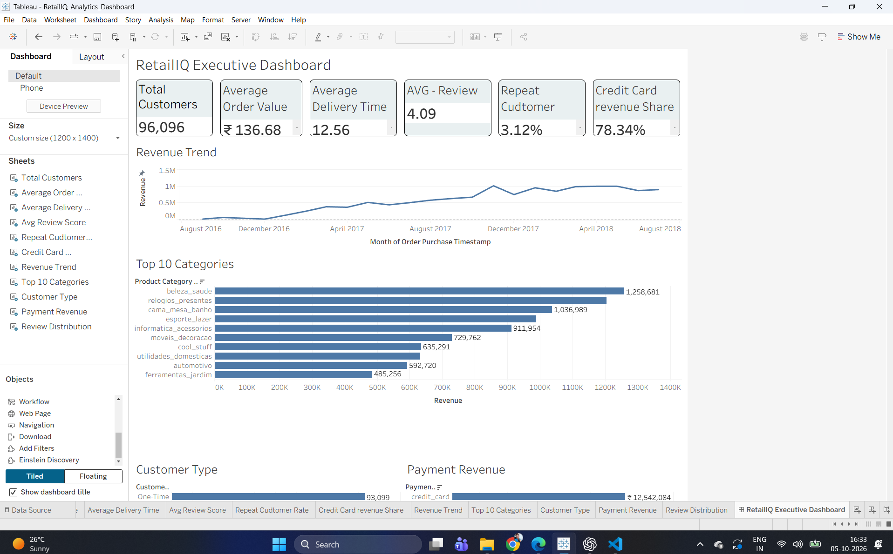
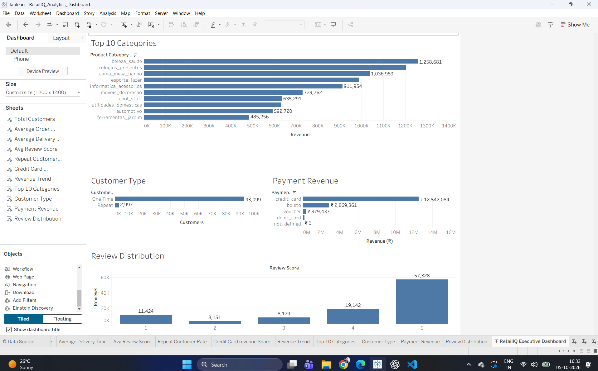

# RetailIQ Analytics

## 📊 E-Commerce Data Analytics Project

RetailIQ Analytics is an end-to-end data analytics project built using the **Olist Brazilian E-Commerce Public Dataset**.

The project analyzes customer behavior, sales performance, product categories, payment methods, delivery performance, customer reviews, and customer segmentation to generate actionable business insights.

The project follows a complete analytics workflow:

**Data Understanding → Data Cleaning → Exploratory Data Analysis → SQL Business Analysis → Customer Segmentation → Tableau Dashboard → Business Insights**

---

## 🎯 Business Objective

The objective of this project is to analyze e-commerce transaction data and answer key business questions such as:

- Which product categories generate the most revenue?
- How is revenue changing over time?
- What percentage of customers make repeat purchases?
- Which customer segments contribute the most revenue?
- Which payment methods are most commonly used?
- How does delivery performance relate to customer satisfaction?
- Which customer segments and categories should the business focus on?

---

## 🗂️ Dataset

The project uses the **Olist Brazilian E-Commerce Public Dataset**, containing information about:

- Customers
- Orders
- Order Items
- Products
- Sellers
- Payments
- Reviews
- Geolocation
- Product Category Translation

The final processed data contains:

- **99K+ orders**
- **112K+ order items**
- **99K+ reviews**
- **96K+ unique customers**
- **32K+ products**
- **3K+ sellers**

---

## 🛠️ Tools & Technologies

| Tool | Purpose |
|---|---|
| Python | Data cleaning, validation and exploratory analysis |
| Pandas | Data manipulation and transformation |
| Jupyter Notebook | Analysis workflow and documentation |
| PostgreSQL | Database management and SQL analysis |
| SQL | Business analysis and customer segmentation |
| Tableau | Interactive dashboard and visualization |
| Git & GitHub | Version control and project management |

---

## 📁 Project Structure

```text
RetailIQ-Analytics/
│
├── data/
│   ├── raw/
│   └── processed/
│
├── database/
│
├── dashboard/
│
├── images/
│   ├── retailiq_dashboard_top.png
│   └── retailiq_dashboard_bottom.png
│
├── notebooks/
│   ├── 01_Data_Understanding.ipynb
│   ├── 02_data_cleaning.ipynb
│   ├── 03_eda_business_analysis.ipynb
│   ├── 04_sql_setup.ipynb
│   └── 05_sql_business_analysis.ipynb
│
├── reports/
│
├── sql/
│
├── .gitignore
├── README.md
└── requirements.txt


🔄 Project Workflow
1. Data Understanding

The first stage focused on understanding the structure and quality of the Olist datasets.

Key activities
Inspected dataset dimensions and data types
Identified missing values
Checked duplicate records
Analyzed relationships between datasets
Identified potential data quality issues
Reviewed primary and foreign key relationships
2. Data Cleaning & Validation

The raw datasets were cleaned and transformed into analysis-ready datasets.

Key cleaning activities
Handled missing values
Standardized column names and data types
Converted date columns into appropriate formats
Validated numerical fields
Checked duplicate identifiers
Validated foreign-key relationships
Identified orphan records
Created cleaned datasets for downstream analysis

The final processed datasets were validated using duplicate and referential-integrity checks.

3. Exploratory Data Analysis

Exploratory analysis was performed to understand overall business performance and identify important trends.

Areas analyzed
Revenue trends
Product category performance
Customer purchasing behavior
Payment methods
Order status
Delivery performance
Customer reviews
Repeat purchase behavior
Revenue Analysis

Total revenue based on order-item prices:

₹13.59M

Revenue concentration was also analyzed:

Top 5 categories → 39.74% of revenue
Top 10 categories → 62.36% of revenue
🗄️ SQL Business Analysis

The cleaned datasets were loaded into PostgreSQL and analyzed using SQL.

SQL analysis covered:

Revenue and order KPIs
Monthly revenue trends
Product category performance
Payment analysis
Customer purchase frequency
Repeat customer analysis
Customer revenue analysis
Review analysis
Delivery performance
RFM-style customer segmentation
Category-level repeat purchase analysis
Data validation
👥 Customer Analysis

One of the major findings was the low repeat-purchase rate.

Metric	Result
Total customers	96,096
One-time customers	93,099
Repeat customers	2,997
Repeat customer rate	3.12%

Although repeat customers represent only 3.12% of customers, they generate higher average customer revenue than one-time customers.

Repeat Purchase Behavior
Average time between orders → 77.86 days
Median time between orders → 28 days
Purchases within 30 days → 51.21%
Purchases within 90 days → 69.63%
Purchases within 180 days → 83.86%

This indicates a significant opportunity for customer retention and re-engagement strategies.

🎯 Customer Segmentation

An RFM-style segmentation approach was used to classify customers into four business segments:

Champions
Loyal Customers
Potential Customers
At Risk / Low Value
Segment Performance
Segment	Customers	Revenue	Revenue Share
Champions	23,912	₹6.78M	49.86%
Loyal Customers	35,417	₹5.31M	39.07%
Potential Customers	24,219	₹1.16M	8.50%
At Risk / Low Value	11,872	₹0.35M	2.57%
Key Finding

Champions + Loyal Customers account for approximately 63% of customers but generate nearly 89% of total revenue.

This makes these segments particularly important for retention and loyalty initiatives.

💳 Payment Analysis

Credit cards were the dominant payment method.

Payment Method	Revenue Share
Credit Card	78.34%
Boleto	17.92%
Voucher	2.37%
Debit Card	1.36%

Credit cards contribute the majority of payment revenue, indicating strong dependence on this payment channel.

⭐ Review & Delivery Analysis

The overall average review score was:

4.09 / 5

Review Distribution
Review Score	Reviews	Share
1	11,424	11.51%
2	3,151	3.18%
3	8,179	8.24%
4	19,142	19.29%
5	57,328	57.78%

Average delivery time:

12.56 days

The analysis also found a negative relationship between delivery time and review score:

Correlation = -0.334

This suggests that longer delivery times are generally associated with lower customer satisfaction.

📈 Tableau Dashboard

An interactive RetailIQ Executive Dashboard was developed using Tableau.

The dashboard provides an executive-level view of:

Total Customers
Average Order Value
Average Delivery Time
Average Review Score
Repeat Customer Rate
Credit Card Revenue Share
Monthly Revenue Trend
Top 10 Product Categories
Customer Type Distribution
Payment Revenue Analysis
Review Score Distribution
Key Dashboard KPIs
KPI	Value
Total Customers	96,096
Average Order Value	₹136.68
Average Delivery Time	12.56 days
Average Review Score	4.09
Repeat Customer Rate	3.12%
Credit Card Revenue Share	78.34%

### Dashboard Preview

#### Executive Dashboard - Top



#### Executive Dashboard - Bottom



💡 Key Business Insights
1. Strong Revenue Concentration

The top 10 product categories generate 62.36% of total revenue, indicating significant revenue concentration among major categories.

2. Low Customer Retention

Only 3.12% of customers are repeat customers, highlighting a major opportunity for retention and re-engagement strategies.

3. High-Value Customers Drive Revenue

Champions and Loyal Customers generate approximately 88.93% of total revenue.

4. Credit Cards Dominate Payments

Credit cards contribute 78.34% of payment revenue, making them the primary payment channel.

5. Delivery Affects Customer Satisfaction

The negative correlation between delivery time and review score suggests that improving delivery performance could contribute to better customer satisfaction.

6. Revenue Does Not Guarantee Repeat Purchases

High-revenue categories do not necessarily have the highest repeat-customer rates, suggesting that category performance and customer retention should be analyzed separately.

📌 Business Recommendations
Customer Retention
Introduce targeted re-engagement campaigns for one-time customers.
Create loyalty incentives for repeat purchases.
Target customers approaching the typical repeat-purchase window.
High-Value Customers
Develop loyalty programs for Champions and Loyal Customers.
Provide personalized offers and early access to promotions.
Focus retention efforts on high-value customer segments.
Delivery Performance
Focus on reducing delivery delays.
Monitor delivery performance by region, seller, and category.
Prioritize logistics improvements for high-value customers.
Product Categories
Protect and grow high-revenue categories.
Investigate why some high-revenue categories have relatively low repeat-purchase rates.
Identify categories with strong potential for cross-selling.
Payment Strategy
Continue optimizing the credit-card payment experience.
Analyze alternative payment methods for customer segments with lower adoption.
📊 Project Outcomes

This project demonstrates an end-to-end data analytics workflow involving:

Data understanding
Data cleaning
Data validation
Exploratory data analysis
SQL analytics
Customer segmentation
Business KPI development
Data visualization
Dashboard development
Business recommendations

The project converts raw e-commerce data into actionable business insights using Python, SQL, PostgreSQL and Tableau.

👨‍💻 Author

Somveer Rathor

Data Analytics | SQL | Python | PostgreSQL | Tableau

⭐ Project Highlights

99K+ Orders Analyzed
112K+ Order Items
99K+ Reviews
96K+ Unique Customers
₹13.59M Revenue Analyzed
End-to-End Analytics Workflow